# V's Toy

### Live Demo

Skip the reading and go straight to a live version of the site here:
[https://viola-hu.github.io/proj3_react_frontend/#/](https://viola-hu.github.io/proj3_react_frontend/#/)

Check out the back-end code here:
[https://github.com/viola-hu/proj3_rails_backend](https://github.com/viola-hu/proj3_rails_backend)

### Features & How it Looks

#### 1. This is a responsive e-commerce site selling cute kid toys.

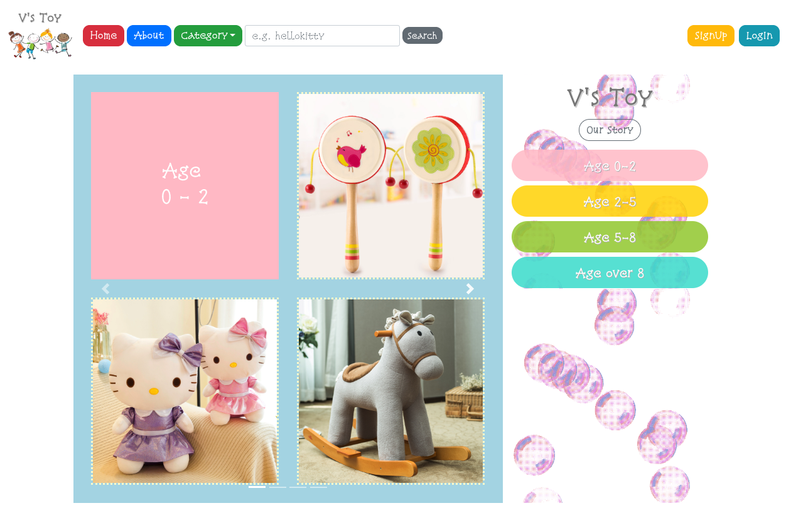
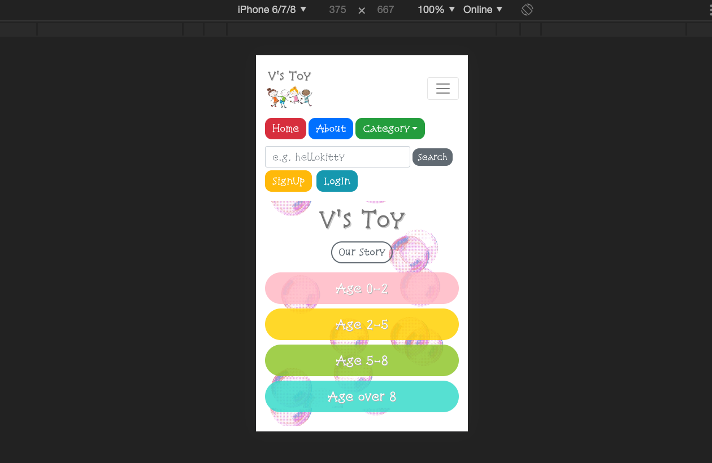

#### 2. In About page, users can use embedded Google map to find store locations.

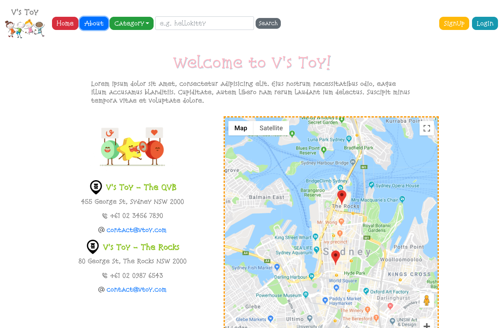

#### 3. Via search feature users can search for related products. Alternatively, users can simply browse through the lovely products from the four age categories.  

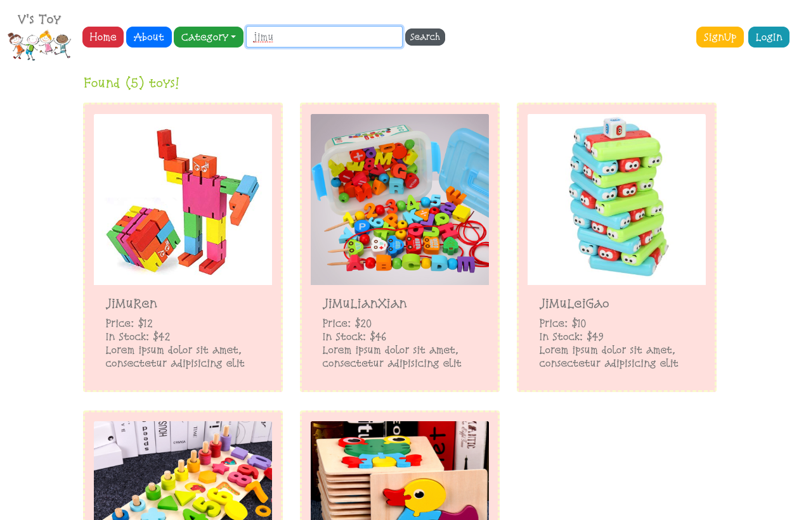
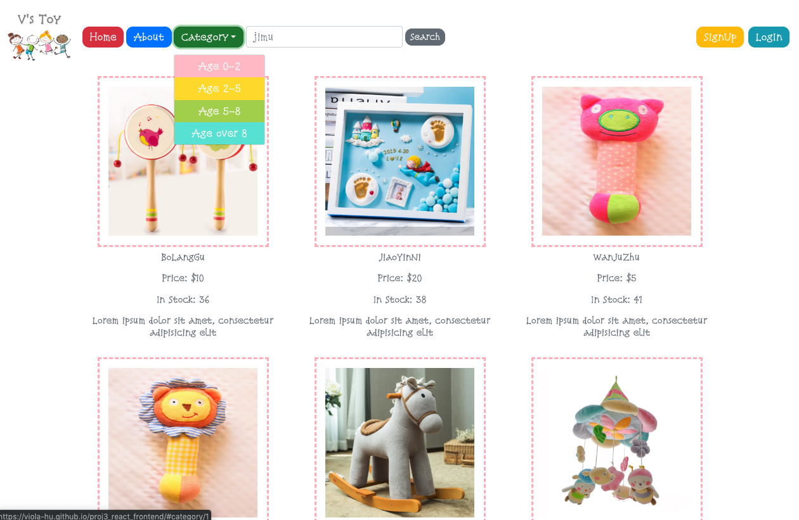

#### 4. With the image zooming feature, users can better inspect products with more details.

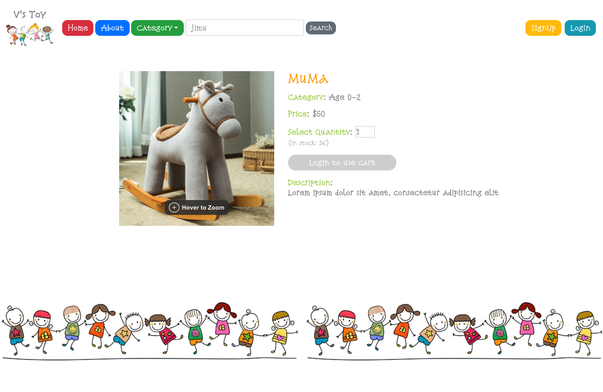
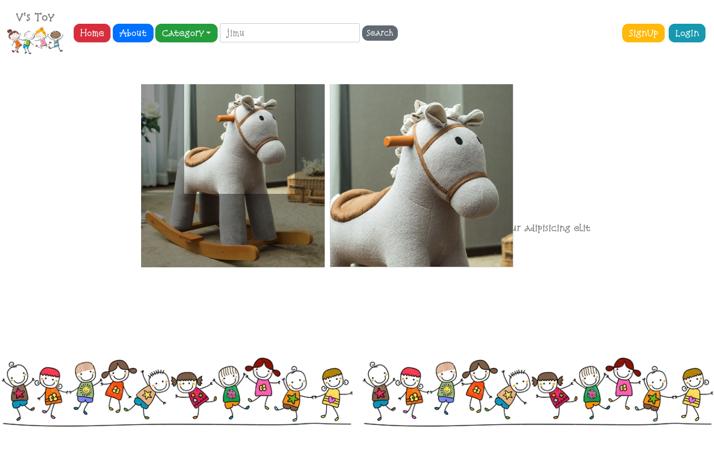

#### 5. Once logging in, users can add products to shopping cart and confirm cart items.

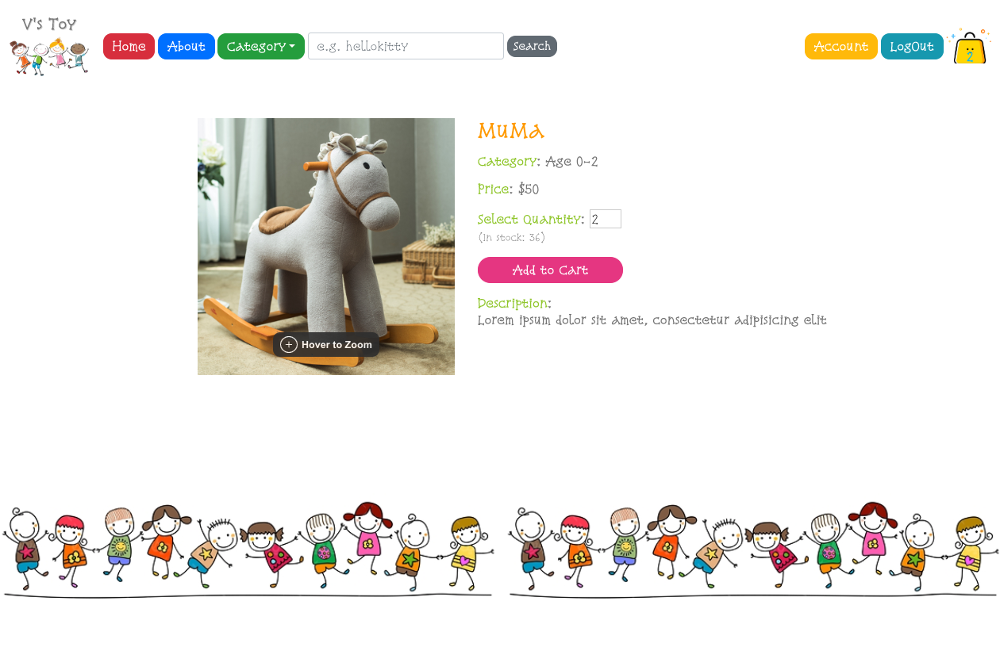
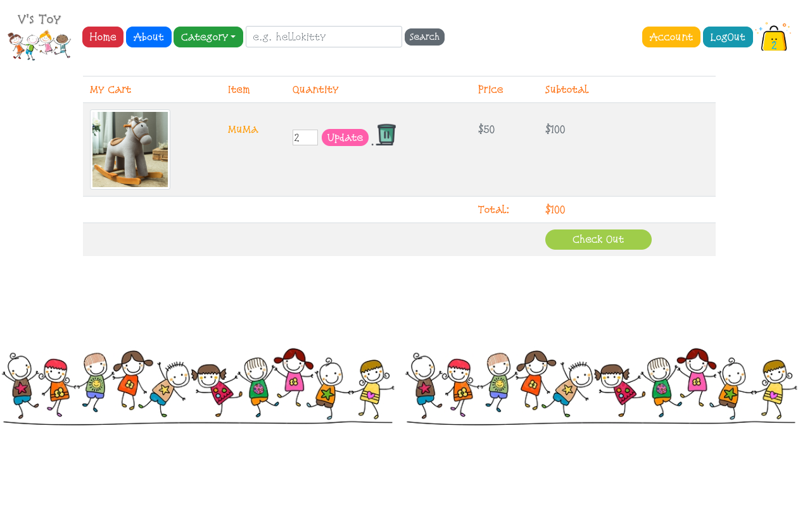

#### 6. Using Stripe payment API, users can then proceed to payment process.

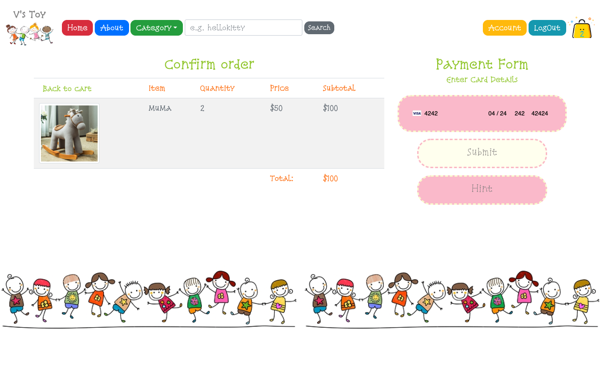
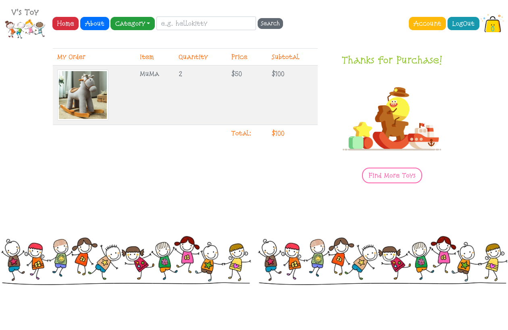

#### 7. After purchase, users can check their purchase history in the Account page.

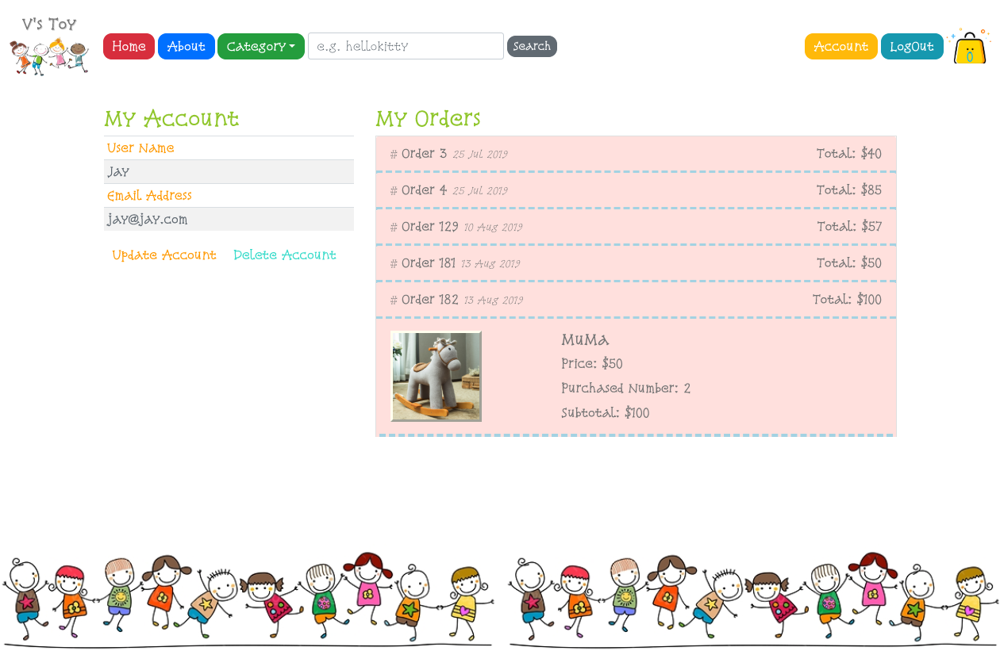

### Frontend Built With
* React.js / JavaScript
* Bootstrap / CSS

#### Frontend Packages & APIs
* axios
* react-bootstrap
* google-maps-react
* react-image-magnify
* react-stripe-elements
* gh-pages (for deployment)

### Backend Built With
* Rails
* PostgresQL

#### Backend Gems
* bcrypt
* knock
* rack-cors
* stripe
* rails_12factor (for deployment)

### Known bugs
When users click submit payment form multiple times by accident, extra orders will be generated with $0.

### Wish List
* Admin Rights
* Implement Discount or Sale options
* Simulate Delivery System
* Introduce User Review
* Enable Price Filter in Search Bar
